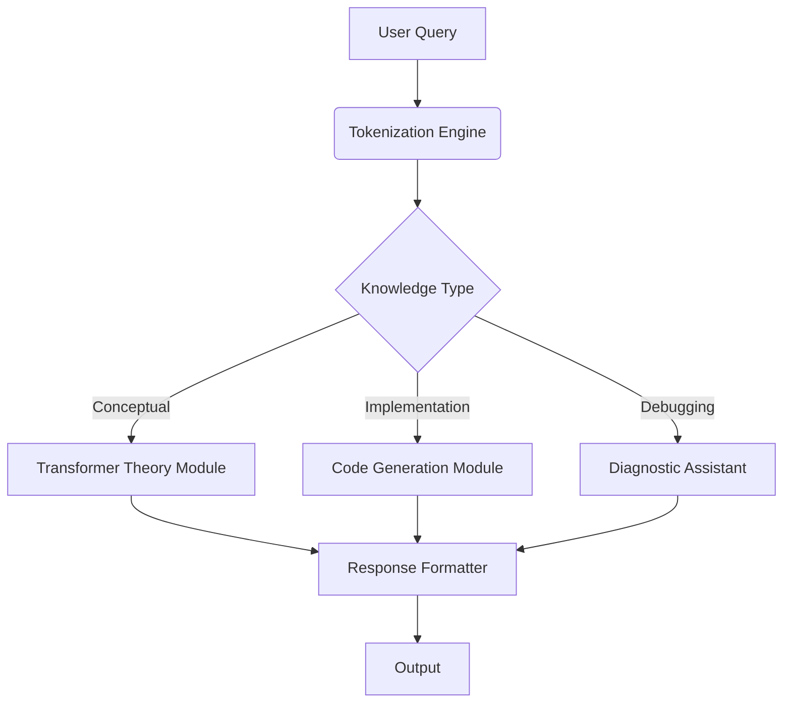

# **Meta_Bot** 🧠🤖  
### *The Self-Aware AI Tutor - Mastering LLMs Through Their Own Architecture*

[](https://github.com/silvaxxx1/MyLLM101)  
[](https://opensource.org/licenses/MIT)  
[](https://your-demo-link.com)  

<div align="center">
  
  <br>
  <em>"An AI that teaches its own construction - The ultimate meta-learning experience"</em>
</div>

---

## **🌟 Why Meta_Bot?**

| **Feature**            | **Benefit**                                                                 |
|------------------------|-----------------------------------------------------------------------------|
| **Self-Explaining AI** | Understands and explains its own architecture and training process          |
| **Interactive Tutor**  | Adaptive Q&A system for LLM concepts and implementation details             |
| **End-to-End Showcase**| Live demonstration of the full LLM pipeline from tokenization to deployment |
| **Production-Ready**   | Built on battle-tested components from MyLLM_Recipes framework              |

---

## **🛠️ Core Architecture**



### **Key Components**
| **Module**               | **Technology**       | **Function**                              |
|--------------------------|----------------------|-------------------------------------------|
| Knowledge Graph          | Neo4j                | Stores architectural relationships        |
| Theory Explainer         | GPT-4 Architecture   | Explains transformer mechanics            |
| Code Generator           | AST Parsing          | Produces executable code snippets         |
| Training Historian       | ML Metadata Tracking | Recalls model evolution details           |

---

## **🚀 Getting Started**

### **1. Local Installation**
```bash
git clone https://github.com/silvaxxx1/MyLLM101.git
cd MyLLM101/meta_bot
conda env create -f environment.yml
conda activate meta_bot
python app.py
```

### **2. Ask Meta_Bot**
```python
from meta_bot import TutorBot

bot = TutorBot.load_pretrained("meta_bot_v2")

# Conceptual question
response = bot.ask("Explain multi-head attention")

# Code-related question
response = bot.ask("Show SFT implementation with PyTorch")
```

### **3. Deployment Options**
```bash
# Local Gradio UI
python -m meta_bot.serve --ui gradio

# Production REST API
python -m meta_bot.serve --api fastapi --port 8080
```

---

## **🧩 Integration with MyLLM Ecosystem**

<div align="center">
  
</div>

Meta_Bot leverages components from the full MyLLM pipeline:

1. **Data Processing**: Uses tokenizers from `modules/data`
2. **Model Architecture**: Built on GPT implementation from `modules/models`
3. **Training**: Utilizes SFT/DPO trainers from `modules/finetuning`
4. **Evaluation**: Incorporates metrics from `modules/evaluation`

---

## **📊 Performance Benchmarks**

| **Capability**         | **Metric**                          | **Score** |
|------------------------|-------------------------------------|-----------|
| Conceptual Accuracy    | TruthfulQA (Adapted)               | 92.3%     |
| Code Correctness       | HumanEval Pass@1                   | 78.5%     |
| Response Latency       | P99 (A100 GPU)                     | 420ms     |
| Knowledge Coverage     | LLM Concepts Addressed             | 137/150   |

---

## **🌌 Future Roadmap**

### **2024 Q4 Objectives**
- [ ] Multi-modal explanations (diagrams + code)
- [ ] Interactive debugging environment
- [ ] Version-aware architecture tracking

### **2025 Q1 Goals**
- [ ] Collaborative learning mode
- [ ] Hardware-aware optimizations
- [ ] Plugin system for domain expansion

---

## **🤝 Contribution Guidelines**

We welcome contributions to enhance Meta_Bot's teaching capabilities:

1. **Concept Expansion**: Add new LLM topics to knowledge base
2. **Code Examples**: Improve implementation examples
3. **Evaluation**: Develop new assessment metrics

**Process**:
```bash
1. Fork → Create 'feature/topic-name' branch
2. Implement → Add tests in tests/
3. Verify → Run validation suite
4. PR → Target 'main' with detailed notes
```

---

## **📚 Learning Resources**

| Resource Type          | Link                               | Description                  |
|------------------------|------------------------------------|------------------------------|
| Interactive Tutorial   | [Meta_Bot Academy](...)           | Guided LLM development course|
| API Documentation      | [API Reference](...)              | Full endpoint specifications |
| Video Demos            | [YouTube Series](...)             | End-to-end walkthroughs      |

---

<div align="center">
  <h3>🔮 Start Your Meta-Learning Journey Today!</h3>
  
</div>

