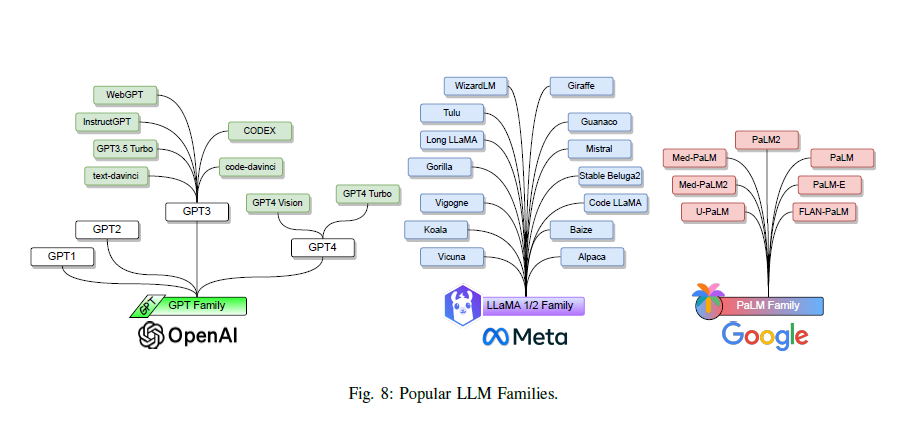

# MyLLM Models

<p align="center">
    
</p>

Welcome to the **MyLLM/models** repository! This module contains the **PyTorch architectures** for various state-of-the-art language models, designed to be easily imported and used with pre-trained weights. It serves as part of a larger framework, including modules for **data**, **training**, and **fine-tuning**, to provide an end-to-end solution for NLP tasks.

## Overview

The **MyLLM/models** repository focuses on providing flexible, well-organized architectures for several popular language models. These models are designed to be **easily integrated** with other parts of your NLP pipeline. The models are implemented using **PyTorch**, and the weights are ready to be loaded for fast inference or fine-tuning.

### Available Models

Below is an overview of the available models, each implemented with the flexibility needed for various NLP tasks:

### 1. **GPT-2** (All Variants)

We have implemented **GPT-2** in all of its variants, from smaller models to larger ones. Each model architecture is designed to generate **coherent and contextually relevant text**. These models can be directly imported, and pre-trained weights can be loaded for immediate use in tasks like:

- Text generation
- Summarization
- Dialogue systems

The models are ready for inference out of the box, but you can also fine-tune them on your own data.

### 2. **Llama 2 - 7B**

The **Llama 2 7B** model architecture is optimized for **high performance with limited resources**. It strikes a balance between accuracy and efficiency, allowing for high-quality language generation without requiring heavy computational resources. It can be used for:

- Text generation
- Contextual language understanding
- Question answering

This model is designed to be efficient enough to run on machines with limited resources while still maintaining strong performance.

### 3. **Llama 3.2 (1B & 3B)**

The **Llama 3.2** models (1B and 3B parameters) are the latest additions, improving both speed and accuracy. These architectures are trained using advanced techniques and are suitable for:

- Advanced language understanding
- Complex question answering
- Contextual reasoning tasks

These models are great for applications requiring high levels of accuracy and context handling.

## Key Features

### 1. **Modular and Easy-to-Use**

- **Architecture-Only**: The repository contains only the **model architectures** in PyTorch. Weights are not included directly, but pre-trained weights are ready to be loaded.
- **Plug-and-Play**: Models can be easily imported into your project, and weights can be loaded with minimal setup. This makes it easy to integrate them into your **data pipeline**, **training module**, or **fine-tuning module**.

### 2. **Pre-trained Weights Ready for Use**

The model architectures are designed to load **pre-trained weights**. These weights are ready to be used for inference, or fine-tuned on custom datasets if needed. This allows for quick experimentation and deployment.

### 3. **Scalable and Flexible**

The architecture of the models is designed to be **scalable** across different machine configurations, from low-resource setups to more powerful systems. With optimizations in place, these models are suitable for use with only CPUs, allowing you to deploy them in environments without GPUs.

### 4. **Integration with Other Modules**

This module is part of a larger ecosystem with the following related modules:

- **Data**: Handling data preprocessing, tokenization, and dataset preparation.
- **Training**: A comprehensive module for training models from scratch or fine-tuning pre-trained weights on custom datasets.
- **Fine-tuning**: Optimized workflows for fine-tuning models on your specific NLP tasks.
  
Each of these modules integrates seamlessly, providing a unified framework for building and deploying state-of-the-art NLP models.

## Installation

To get started, clone the repository and install the required dependencies:

```bash
git clone https://github.com/yourusername/MyLLM.git
cd MyLLM
pip install -r requirements.txt
```

## Usage

### Importing Models

You can import any of the models from this module and load the pre-trained weights as shown below.

#### Example 1: **GPT-2**

```python
from myllm.models import GPT2

# Load GPT-2 architecture and pre-trained weights
model = GPT2.from_pretrained("gpt2-medium")

# Perform inference
input_text = "Once upon a time"
output = model.generate(input_text, max_length=100)
print(output)
```

#### Example 2: **Llama 2 - 7B**

```python
from myllm.models import Llama2

# Load Llama 2 model
model = Llama2.from_pretrained("llama2-7b")

# Perform inference
input_text = "What is the capital of France?"
output = model.generate(input_text, max_length=50)
print(output)
```

#### Example 3: **Llama 3.2 (1B & 3B)**

```python
from myllm.models import Llama3_2

# Load Llama 3.2 model (1B or 3B)
model = Llama3_2.from_pretrained("llama3_2-1b")

# Perform inference
input_text = "Explain quantum mechanics in simple terms."
output = model.generate(input_text, max_length=100)
print(output)
```

## Future Enhancements

The **MyLLM/models** module will continue to evolve. We are working on adding more architectures and features:

- **BERT**: Implementations of various BERT-based models for classification, named entity recognition (NER), and other downstream tasks.
- **Multilingual Models**: Extending the repository to include multilingual model architectures for cross-lingual tasks.
- **Support for more models**: We plan to integrate additional language models like **T5**, **BART**, and **OPT**.

## Contribution

We welcome contributions to this repository! If you'd like to add new models, improve existing ones, or help enhance the project, please open a pull request. Be sure to follow the contribution guidelines in the repository.

## License

This project is licensed under the MIT License - see the [LICENSE](LICENSE) file for details.
