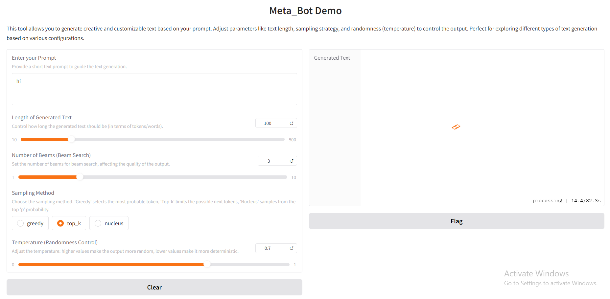

# MyLLM Model Inference Directory  

Welcome to the **GPT Model Inference Directory**! This repository provides efficient scripts for loading and generating text using GPT models, allowing seamless interaction through both **command-line interfaces** and a **web-based Gradio app**.


<p align="center">
    
</p>

## 🚀 Overview  

This directory contains core scripts that enable:  
✔️ **Loading and fine-tuning GPT models** for inference.  
✔️ **Generating text with customizable parameters** (e.g., temperature, top-k, beam search).  
✔️ **Interactive web-based text generation** using Gradio.  

Whether you prefer running inference via the **command line** or using a **web UI**, this repository has you covered!  

---

## 📜 Scripts  

### 🔹 `load_model.py`  
A utility script for **loading pre-trained GPT models** from checkpoint files.  

✅ Loads GPT models and prepares them for inference.  
✅ Ensures models are set to **evaluation mode** for efficiency.  

---

### 🔹 `gpt_inference.py`  
A **command-line interface (CLI)** for generating text using a specified GPT model.  

#### **Usage:**  
```bash
python gpt_inference.py --prompt "Your prompt here" --max_length 100 --temperature 0.7 --top_k 50 --model_name "gpt2"
```
✅ **Customizable parameters:** Modify max length, temperature, and top-k sampling.  
✅ Supports various **GPT architectures**.  

---

### 🔹 `gpt_app.py`  
A **Gradio-powered web application** for real-time text generation.  

#### **Run the App:**  
```bash
python gpt_app.py
```
Once running, access the interactive UI via the **local or public link** displayed in the terminal.  

✅ **User-friendly web interface** for experimenting with different text generation strategies.  
✅ Supports **Greedy, Top-k, and Nucleus (Top-p) sampling**.  
✅ Adjustable **temperature and beam search** for fine-tuned control.  

---

## 🛠 Requirements  

To use these scripts, install the necessary Python packages:  

```bash
pip install torch gradio
```

---

## 🎯 Conclusion  

With these scripts, you can easily:  
✔️ **Load and deploy GPT models** for inference.  
✔️ **Generate text using different strategies** (Greedy, Top-k, Nucleus).  
✔️ **Interact with GPT models via CLI or web UI**.  

Feel free to modify and extend the functionality to suit your needs! 🚀  
```