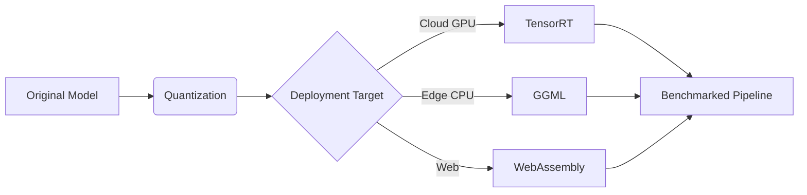

# **🔩 MyLLM: Modular Framework**  
## *Structured Components for End-to-End LLM Development*

<div align="center">
  
  <br>
  <em>"From raw data to optimized inference - A production-ready pipeline"</em>
</div>

---

## **📂 Folder Structure**

```bash
modules/
├── data/                 # Data preprocessing
│   ├── preprocessing.py  # Text cleaning/normalization
│   ├── tokenization/     # Tokenizer implementations
│   └── dataloaders.py    # Streaming/batching
│
├── models/               # Model architectures
│   ├── gpt/              # Autoregressive Transformer
│   ├── llama/            # Memory-efficient RoPE
│   └── bert/             # Bidirectional Encoder
│
├── training/             # Core training logic
│   ├── cpu_trainer.py    # Single-node CPU training
│   ├── gpu_trainer.py    # Single-GPU pipeline
│   └── multi_gpu/        # Distributed strategies
│
├── finetuning/           # Specialized tuning
│   ├── sft/              # Supervised Fine-Tuning
│   ├── dpo/              # Direct Preference Optimization
│   └── ppo/              # Proximal Policy Optimization
│
├── inference/            # [In Progress] Deployment
│   ├── basic_ui/         # Existing Gradio/Streamlit UI
│   └── optimization/     # Your focus area ⚡
│
└── evaluation/           # [Planned] Model assessment
```

---

## **⚡ Inference Optimization Roadmap**

### **1. Quantization Techniques**
```python
# modules/inference/optimization/quantization.py
def quantize_model(model, precision='fp16'):
    if precision == 'int8':
        return torch.quantization.quantize_dynamic(model)
    elif precision == 'fp16':
        return model.half()
```

| Technique       | Target Hardware | Expected Speedup | Accuracy Impact |
|-----------------|-----------------|------------------|-----------------|
| FP16            | Modern GPUs     | 2-4x             | Minimal         |
| INT8 Dynamic    | CPU/Edge        | 3-5x             | <1% Drop        |
| QAT (Future)    | All             | 4x               | Configurable    |

### **2. Kernel Optimization**
```python
# modules/inference/optimization/kernels.py
class OptimizedAttention(nn.Module):
    def forward(self, q, k, v):
        return flash_attn(q, k, v)  # Using FlashAttention-v2
```

### **3. Model Export Formats**
```bash
modules/inference/optimization/export/
├── onnx_exporter.py       # ONNX runtime support
├── tensorrt_converter.py  # NVIDIA-specific optimizations
└── ggml_quantizer.py      # CPU-focused 4-bit quantization
```

### **4. Serving Infrastructure**
```python
# modules/inference/optimization/serving.py
class APIServer:
    def __init__(self, model):
        self.cache = ResponseCache()  # Caching common queries
        self.batcher = DynamicBatcher()  # Batch incoming requests
```

---

## **🔧 Current Implementation Status**

| Component          | Status  | Version | Dependencies     |
|--------------------|---------|---------|------------------|
| Basic UI           | ✅ Prod  | v1.2    | Gradio, Streamlit|
| FP16 Quantization  | 🚧 Beta | v0.8    | PyTorch 2.1+     |
| FlashAttention     | ✅ Prod  | v2.0    | CUDA 11.8        |
| ONNX Export        | 🚧 WIP  | v0.3    | onnxruntime      |

---

## **🚀 Optimization Quick Start**

### **1. Basic Quantization**
```python
from modules.models import GPT
from modules.inference.optimization import quantize_model

model = GPT.from_pretrained("gpt_medium")
quant_model = quantize_model(model, precision='fp16')
```

### **2. Optimized Serving**
```bash
# Start optimized API server
python -m modules.inference.optimization.serving \
  --model ./checkpoints/gpt_fp16 \
  --quantize \
  --use_cache \
  --port 8080
```

### **3. Kernel Benchmarking**
```python
from modules.inference.optimization.benchmark import compare_kernels

results = compare_kernels(
    model=model,
    input_seq="The future of AI is",
    kernels=["vanilla", "flash", "xformers"]
)
```

---

## **🔥 Key Optimization Strategies**

<div align="center">
  
</div>

### **A. Hardware-Specific Optimization**
```python
# modules/inference/optimization/hardware.py
def configure_for_hardware(model, device):
    if device.type == 'cuda':
        model = fuse_cuda_ops(model)
    elif device.type == 'cpu':
        model = apply_mkl_optimizations(model)
    return model
```

### **B. Dynamic Batching**
```python
# modules/inference/optimization/batching.py
class DynamicBatcher:
    def __init__(self, max_batch_size=32, timeout=0.1):
        self.requests = []
        self.max_batch_size = max_batch_size
        self.timeout = timeout

    def add_request(self, request):
        """Batch requests until timeout/max size reached"""
```

### **C. Cache Optimization**
```python
# modules/inference/optimization/caching.py
class KVcache:
    def __init__(self, cache_size=1024):
        self.cache = {}
        self.cache_size = cache_size

    def get(self, prompt):
        """Retrieve cached computations for common prefixes"""
```

---

## **⚠️ Common Challenges & Solutions**

| Challenge                  | Solution                                  | Module Reference               |
|----------------------------|-------------------------------------------|---------------------------------|
| Quantization Accuracy Drop | Use QAT (Quantization-Aware Training)     | `training/quant_aware_train.py`|
| GPU Memory Limits          | Enable Paged Attention                    | `models/attention/memory.py`   |
| Cold Start Latency         | Implement Warmup Script                   | `inference/optimization/warmup`|
| Framework Compatibility    | Use ONNX as Intermediate Format           | `inference/export/onnx.py`     |

---

## **🌌 Future Optimization Pipeline**



---

[](path/to/optimization_docs)  
[](path/to/benchmarks)
