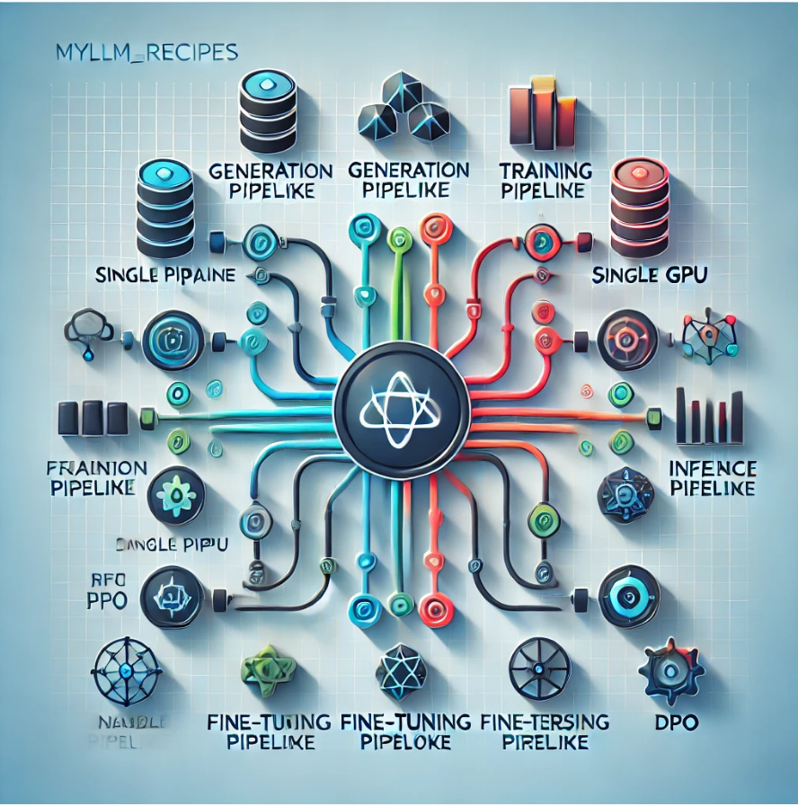

# **MyLLM_Recipes: A Scalable Framework for Building and Fine-Tuning LLMs** 🚀  

Welcome to **MyLLM_Recipes**, the next evolutionary step in the **MyLLM101** project! This repository is designed to transition from notebook experiments to a **scalable, professional-grade framework** for working with large language models (LLMs). Think of this as your **DIY Hugging Face Transformers**—learn every piece of the puzzle while building your own masterpiece.  

<div align="center">  
    
</div>  

---

## 🌟 **Project Overview**  

**MyLLM_Recipes** empowers you to:  
- **Load Models**: Seamlessly initialize models or load pretrained ones.  
- **Train Models**: Efficiently train LLMs with optimized pipelines for various hardware configurations.  
- **Fine-Tune Models**: Adapt pretrained models for tasks using SFT, PPO, and DPO techniques.  
- **Generate Text**: Harness advanced generation pipelines for high-quality text.  
- **Deploy Models**: Build interactive applications using Gradio with ease.  

This framework will be the foundation for creating **Meta_Bot**—an AI tutor capable of teaching the process of its creation.  

---

## 💡 **Key Features**  

### **🛠️ Built Purely with PyTorch**  
Designed with **pure PyTorch**, ensuring:  
- **Lightweight, Transparent Code**: No unnecessary bloat—just clean, efficient PyTorch implementations.  
- **Complete Customization**: Modify any component to meet your needs.  
- **Performance Optimization**: Direct control over PyTorch’s capabilities for training and inference.  

### **🔗 Modular Pipelines for Every Stage**  

#### 1. **Data Pipeline**  
- Tools for preprocessing, tokenization, and augmentation.  
- Supports custom workflows to handle diverse datasets.  

#### 2. **Generation Pipeline**  
- Set up advanced text generation strategies like **top-k**, **top-p**, and **beam search**.  

#### 3. **Training Pipelines**  
- **From Scratch**:  
  - **Simple Trainer**: Single-GPU training with minimal setup.  
  - **Optimized Trainer**: Incorporates mixed precision and gradient accumulation.  
  - **Multi-GPU Trainer**: Distributed training for scaling up.  

- **Fine-Tuning**:  
  - **SFTTrainer**: For classification and instruction-based tasks.  
  - **PPOTrainer**: Leverage reinforcement learning to fine-tune LLMs.  
  - **DPOTrainer**: Optimize decision-making processes for advanced applications.  

#### 4. **Evaluation Pipeline**  
- Built-in metrics tracking and visualization for systematic model evaluation.  
- Compatible with **TensorBoard** and **Weights & Biases** for seamless monitoring.  

#### 5. **Inference and Deployment**  
- Fast, efficient model predictions via an **inference pipeline**.  
- User-friendly integration with **Gradio** for interactive web applications.  

---

## 🔥 **Framework Highlights**  
- **Automatic Hardware Detection**: Dynamically configures for CPU, single GPU, or multi-GPU setups.  
- **Robust Evaluation Metrics**: Measure model accuracy, fluency, and relevance.  
- **Visualization Tools**: Get insights into your training progress with built-in support for leading visualization platforms.  

---

## 📋 **Current Status**  

This repository is evolving! Below is a snapshot of ongoing development:  

| **Feature**               | **Status**      | **Notes**                                   |  
| ------------------------- | --------------- | ------------------------------------------ |  
| Data Pipeline             | 🛠️ Upcoming    | Tools for preprocessing and tokenization.  |  
| Generation Pipeline       | 🛠️ Upcoming    | Advanced text generation techniques.       |  
| Simple Trainer            | 🛠️ Upcoming    | Easy-to-setup single-GPU trainer.          |  
| Optimized Trainer         | 🛠️ Upcoming    | Includes mixed precision and optimizations.|  
| Multi-GPU Trainer         | 🛠️ Upcoming    | Distributed training for scalability.      |  
| SFTTrainer                | 🛠️ Upcoming    | Fine-tune LLMs for specific tasks.         |  
| PPOTrainer                | 🛠️ Upcoming    | Reinforcement learning optimization.       |  
| DPOTrainer                | 🛠️ Upcoming    | Optimize decision-making pipelines.        |  
| Inference Pipeline        | 🛠️ Upcoming    | For fast and efficient predictions.        |  
| Gradio Deployment         | 🛠️ Upcoming    | Build interactive applications.            |  

---

## 🗺️ **Roadmap**  

Here’s how **MyLLM_Recipes** fits into the broader **MyLLM101** project:  
1. Transition from notebook experiments to a modular framework.  
2. Build and optimize pipelines for training, fine-tuning, and evaluation.  
3. Implement state-of-the-art generation and deployment tools.  
4. Use the framework to create **Meta_Bot**—an AI tutor for aspiring ML enthusiasts.  

---

## 🤝 **Contributing**  

We love collaboration! Here’s how you can get involved:  
- Share your ideas to enhance the pipeline designs.  
- Contribute implementations for specific features or components.  
- Report bugs or suggest improvements for better performance.  

Feel free to fork the repo and submit a pull request—let’s build this together!  

---

## 📜 **License**  

This project is licensed under the MIT License. Check out the [LICENSE](LICENSE) file for details.  

---  

Join us on this exciting journey to create a **scalable, modular framework for LLM development** and lay the foundation for **Meta_Bot**! 🚀  

---  

### **Get Started Today** 🌐  

Clone the repo and dive in:  
```bash  
git clone https://github.com/your-repo/MyLLM_Recipes.git  
cd MyLLM_Recipes  
```  