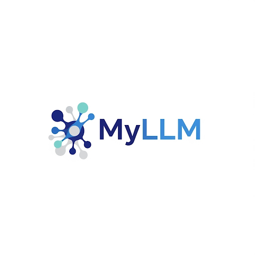

# 🚀 MyLLM: Building *My* Meta\_Bot — From Scratch, For Real

[](https://opensource.org/licenses/MIT)
[](https://www.python.org/downloads/)
[](https://pytorch.org/)

-----

\<p align="center"\>
\
\</p\>

-----

## ⚠️ Work In Progress — Hack at Your Own Risk 🚧

MyLLM isn’t just another library; it's a **playground for learning and building LLMs from scratch**.
This project was born out of a desire to **fully understand every line of a transformer stack**, from tokenization to RLHF.

Here's what's inside right now:

| Area | Status | Description |
| :--- | :--- | :--- |
| **Interactive Notebooks** | ✅ Stable | Step-by-step guided learning path |
| **Modular Mini-Projects** | ✅ Stable | Self-contained, targeted experiments |
| **MyLLM Core Framework** | ⚙️ Active Development | Pure PyTorch, lightweight, transparent |
| **MetaBot** | 🛠 Coming Soon | A chatbot that explains *itself* |

> **Warning:** Some parts are stable, while others are actively evolving.
>
> Use this repo to **explore, experiment, and break things safely** — that's how you learn deeply.

-----

## 🌱 Why MyLLM Exists

There are plenty of libraries out there (Hugging Face, Lightning, etc.), but they hide **too much of the magic**. I wanted something different:

  * **Minimal** – No unnecessary abstractions, no magic.
  * **Hackable** – Every part of the stack is visible and editable.
  * **Research-Friendly** – A place to experiment with cutting-edge techniques like LoRA, QLoRA, PPO, and DPO.
  * **From Scratch** – So you *truly* understand the internals.

This is a framework for **engineers who want to think like researchers** and **researchers who want to ship real systems**.

-----

## 🗺 The Three Layers of MyLLM

MyLLM is structured into three progressive layers, designed to guide you from fundamental understanding to building a complete system.

### **1️⃣ Interactive Notebooks — Learn by Doing**

The `notebooks/` directory is where your journey begins. Each notebook is a step-by-step guide with theory and code, building components from first principles.

```
MyLLM/
 └── notebooks/
                ├── 0.0.WELCOME.ipynb
                ├── 1.1.DATA.ipynb
                ├── 1.2.Tokenizer.ipynb
                ├── 2.1.ATTENTION.ipynb
                ├── 2.2.More_ATTENTION.ipynb
                ├── 2.3.GPT.ipynb
                ├── 2.4.Llama3.ipynb
                ├── 3.1.TRAIN.ipynb
                ├── 3.2.TRAIN_Pro.ipynb
                ├── 4.1.SFT_Text_Classification.ipynb
                ├── 4.2..SFT_Instruction_Following.ipynb
                ├── 4.3.SFT_PEFT.ipynb
                ├── 5.1.RLHF_PPO.ipynb
                ├── 5.2.RL_DPO.ipynb
                ├── 6.1.INFERENCE_Text_Generation.ipynb
                ├── 6.2.KV_Cache.ipynb
                ├── 6.3.Quantization_1.ipynb
                ├── 6.4.Quantization_2.ipynb
                ├── Appandix_A_GPT_2_Llama2.ipynb
                ├── Appandix_B_Gradio.ipynb 
```

💡 *Modify the attention mask in a notebook and see how the output changes — that's hands-on learning at its best.*

-----

### **2️⃣ Modular Mini-Projects — Targeted Experiments**

The `Modules/` folder is a collection of **self-contained experiments**, each focusing on a specific part of the LLM pipeline. This lets you **experiment on one piece of the puzzle** without touching the whole framework.

```
MyLLM/
 └── Modules/
      ├── 1.data/            # Dataset loading and preprocessing utilities
      ├── 2.models/          # Core model architectures (GPT, Llama)
      ├── 3.training/        # Training scripts and utilities
      ├── 4.finetuning/      # Experiments with SFT, DPO, PPO
      └── 5.inference/       # Inference with quantization and KV caching
```

Example: Train a small GPT from scratch

```bash
python Modules/3.training/train.py --config configs/basic.yml
```

-----

### **3️⃣ The MyLLM Core Framework — Hugging Face, But From Scratch**

The `myllm/` folder is where all the components from the notebooks and mini-projects converge into a **production-grade framework**. This is the final layer, designed for scaling, research, and deployment.

```
myllm/
 ├── CLI/             # Command-Line Interface
 ├── Configs/         # Centralized configuration objects
 ├── Train/           # Advanced training engine (SFT, DPO, PPO)
 ├── Tokenizers/      # Production-ready tokenizer implementations
 ├── utils/           # Shared utility functions
 ├── api.py           # RESTful API for model serving
 └── model.py         # The core LLM model definition
```

Example usage:

```python
from myllm.model import LLMModel
from myllm.Train.sft_trainer import SFTTrainer

# Instantiate a model from the core framework
model = LLMModel()

# Fine-tune with a single line of code
trainer = SFTTrainer(model=model, dataset=my_dataset)
trainer.train()

# Every line here maps to real, visible code — no magic.
```

-----

## 🔮 Coming Soon: *MetaBot*

The final vision is **MetaBot** — an interactive chatbot built entirely with MyLLM.

> *A chatbot that not only answers your questions but also **shows you exactly how it works under the hood.***

Built with:

  * MyLLM core framework
  * Gradio for UI
  * Fully open source, located in the `Meta_Bot/` directory.

-----

## 📍 Roadmap

| Status | Milestone | Details |
| :--- | :--- | :--- |
| ✅ | Interactive Notebooks | Learn LLM fundamentals hands-on |
| ✅ | Modular Mini-Projects | Build reusable, composable components |
| ⚙️ | MyLLM Core Framework | Fine-tuning, DPO, PPO, quantization, CLI, API |
| 🛠 | MetaBot + Gradio UI | Interactive chatbot & deployment |

-----

## ⚡ Quick Challenges to Try

  * Run a notebook → tweak hyperparameters → watch how the model changes.
  * Build a mini GPT that writes **haiku poems**.
  * Add a new trainer to the framework (e.g., a TRL variant).
  * Quantize a model and measure the speedup in inference.
  * Fork the repo and contribute a new attention mechanism.

-----

## 🙌 Inspiration

This project wouldn’t exist without the incredible work of others:

  * [Andrej Karpathy](https://github.com/karpathy) — NanoGPT minimalism
  * [Umar Jamil](https://github.com/umarjamil) — Practical LLM tutorials
  * [Sebastian Raschka](https://github.com/rasbt) — Deep transformer insights

-----

## 🏁 The Vision

The end goal: A **transparent, educational, and production-ready LLM stack** built entirely from scratch, by and for engineers who want to **own every line of their AI system**.

Let's strip away the black boxes and **build the future of LLMs — together.**

-----

### 📜 License

[MIT License](https://www.google.com/search?q=./LICENSE)