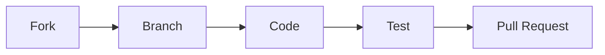

# **MyLLM101: Build Your Meta\_Bot!** 🚀

[](https://opensource.org/licenses/MIT)
[](https://www.python.org/downloads/)
[](https://pytorch.org/)

<div align="center">
  
</div>

---

🚧 **Important Development Notice** 🚧  
**This repository is under active construction!**  
*"I'm building in public to stay accountable - some features below exist as goals rather than working code... yet!"*  
**Current Stable Components:** Core training pipeline, Basic GPT implementation  
**Experimental Features:** DPO, Multi-GPU training (partial support)  

---

## **Table of Contents** 📖
- [Why MyLLM101?](#-why-myllm101)
- [Features](#-features)
- [Project Roadmap](#-project-roadmap)
- [Quick Start](#-quick-start)
- [Advanced Setup](#-advanced-setup)
- [Contributing](#-contributing)
- [Inspiration](#-inspiration)
- [License](#-license)

---

## **✨ Why MyLLM101?**

| **Aspect**          | **What You’ll Achieve**                                                                 |
|----------------------|-----------------------------------------------------------------------------------------|
| **Learn by Building** | Create an AI that understands its own architecture and teaches others.                 |
| **Full LLM Pipeline** | From tokenization to RLHF (PPO/DPO), using **PyTorch** for low-level control.          |
| **Scalable Design**   | Notebooks → Modular code → Distributed training → Production-ready bot.                |
| **Meta-AI Magic**     | Interact with Meta\_Bot to debug models, explain code, and guide your learning journey.|

---

## **🚀 Features**

### **End-to-End LLM Development**
| **Component**         | **Key Capabilities**                                                                 |
|-----------------------|-------------------------------------------------------------------------------------|
| **Interactive Notebooks** | Prototype tokenizers, model layers, and training loops with Colab/Jupyter.          |
| **Modular Framework**      | Reusable modules for datasets (`data/`), models (`models/`), and training scripts.  |
| **Scalable Pipeline**      | Multi-GPU/TPU training, custom tokenizers, and RLHF with PPO/DPO.                   |
| **Meta\_Bot**              | Deploy a chatbot that explains its own codebase and answers LLM theory questions.   |

<div align="center">
  
</div>

---

## **📌 Project Roadmap**

### **Completed** ✅
- Basic GPT Implementation
- Single-GPU Training Pipeline
- Notebook Prototypes (Tokenization, SFT)

### **In Progress** 🚧
```python
current_focus = [
    "Meta_Bot Gradio Interface (50% complete)",
    "Custom Tokenizer (30% implemented)", 
    "DPO Optimization (experimental)"
]
```

### **Upcoming** 📅
```bash
# Planned Features
Q1 2025:
- Quantization Support
- BERT-style Pretraining
- Comprehensive Evaluation Suite

---

## **⚡ Quick Start**

### **Prerequisites**
- Python 3.10+
- PyTorch 2.0+
- CUDA 11.8 (recommended)

### **Installation**
```bash
git clone https://github.com/silvaxxx1/MyLLM101.git
cd MyLLM101
pip install -r requirements.txt
```

### **Basic Training**
```bash
# Start small-scale training (CPU/GPU)
python train.py --config configs/starter.yml
```

### **Launch Dev Chat**
```bash
python -m metabot.chat --mode basic
```

---

## **🔧 Advanced Setup**

### **Multi-GPU Training**
```bash
# Experimental - May require code adjustments
torchrun --nproc_per_node=4 train.py --config configs/distributed.yml
```

### **Custom Components**
```python
from modules import FlexibleTrainer

trainer = FlexibleTrainer(
    model=your_model,
    strategy="mixed_precision",  # Options: [basic, mixed_precision, ddp]
    auto_scale=True  # Automatic batch size adjustment
)
```

---

## **🤝 Contributing**

**We welcome brave contributors!**  
Given the project's early stage, please:  
1. Check open issues for known limitations  
2. Discuss major changes via GitHub Discussions first  
3. Focus on completing existing modules before adding new features  

Contribution Guide:  


---

## **🙏 Inspiration**

This project draws inspiration from:  
- [Umar Jamil's LLM Tutorials](https://www.youtube.com/@umarjamilai)  
- [Andrej Karpathy's nanogpt](https://github.com/karpathy/nanoGPT)  
- [Sebastian Raschka's LLM Book](https://sebastianraschka.com/books/llm-foundations/)  

---

## **📜 License**

MIT License - See [LICENSE](LICENSE) for details.  
*"Build freely, learn deeply!"* 🛠️🧠

---

<div align="center">
  <h3>Join the Journey!</h3>
  
  <br>
  <em>Watch this space transform from concept to cutting-edge toolkit!</em>
</div>
```
