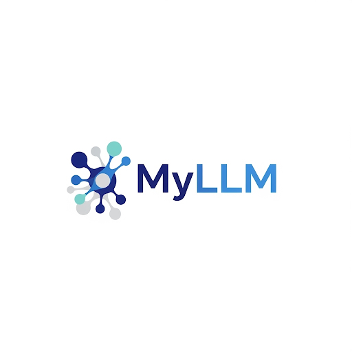

# 🚀 MyLLM: Building *My* Meta_Bot — From Scratch, For Real

<p align="center">
  
</p>


---

## ⚠️ Work In Progress — Hack at Your Own Risk 🚧

**MyLLM** isn’t just another library.  
It’s a **playground for learning, understanding, and building LLMs from scratch** — end to end.

This project was born out of one goal:

> **Understand every single line of a modern transformer stack.**  
> From tokenization → attention → training → RLHF → inference.

### Current Status

| Area | Status | Description |
|----|----|----|
| **Interactive Notebooks** | ✅ Stable | Guided, from-first-principles learning |
| **Modular Mini-Projects** | ✅ Stable | Focused, reusable experiments |
| **MyLLM Core Framework** | ⚙️ Active Development | Pure PyTorch, transparent |
| **MetaBot** | 🛠 Coming Soon | A chatbot that explains itself |

> ⚠️ Some components are stable, others evolve fast.  
> This repo is meant for **exploration, experimentation, and breaking things safely**.

---

## 🌱 Why MyLLM Exists

There are already great libraries (🤗 Hugging Face, Lightning, TRL…).

**But they hide too much.**

MyLLM is intentionally different:

- **Minimal** — no unnecessary abstractions
- **Hackable** — everything is visible and editable
- **Research-friendly** — LoRA, QLoRA, PPO, DPO, quantization
- **From scratch** — so you *actually* understand what’s happening

This project is for:

> **Engineers who want to think like researchers**  
> **Researchers who want to ship real systems**

---

## 🗺 Architecture: The Three Layers of MyLLM

MyLLM is structured as a **learning → experimentation → production pipeline**.

---

## 1️⃣ Interactive Notebooks — *Learn by Doing*

The `notebooks/` directory is the entry point.

Each notebook:
- Explains **theory**
- Implements **from scratch**
- Encourages **modification & experimentation**

```

MyLLM/
└── notebooks/
├── 0.0.WELCOME.ipynb
├── 1.1.DATA.ipynb
├── 1.2.Tokenizer.ipynb
├── 2.1.ATTENTION.ipynb
├── 2.2.More_ATTENTION.ipynb
├── 2.3.GPT.ipynb
├── 2.4.Llama3.ipynb
├── 3.1.TRAIN.ipynb
├── 3.2.TRAIN_Pro.ipynb
├── 4.1.SFT_Text_Classification.ipynb
├── 4.2.SFT_Instruction_Following.ipynb
├── 4.3.SFT_PEFT.ipynb
├── 5.1.RLHF_PPO.ipynb
├── 5.2.RL_DPO.ipynb
├── 6.1.INFERENCE_Text_Generation.ipynb
├── 6.2.KV_Cache.ipynb
├── 6.3.Quantization_1.ipynb
├── 6.4.Quantization_2.ipynb
├── Appendix_A_GPT_2_Llama2.ipynb
└── Appendix_B_Gradio.ipynb

```

💡 *Change an attention mask and immediately see how generation breaks or improves.*

That’s real learning.

---

## 2️⃣ Modular Mini-Projects — *Targeted Experiments*

The `Modules/` directory isolates **one concept at a time**.

```

MyLLM/
└── Modules/
├── 1.data/        # Dataset loading & preprocessing
├── 2.models/      # GPT, LLaMA-style architectures
├── 3.training/    # Training loops & utilities
├── 4.finetuning/  # SFT, DPO, PPO experiments
└── 5.inference/   # KV cache, quantization

````

### Example: Train a small GPT from scratch

```bash
python Modules/3.training/train.py --config configs/basic.yml
````

This lets you experiment **without touching the full framework**.

---

## 3️⃣ MyLLM Core Framework — *HF-like, but transparent*

The `myllm/` directory is where everything converges into a **research-grade framework**.

```
myllm/
 ├── CLI/             # Command-line tools
 ├── Configs/         # Centralized configs
 ├── Train/           # SFT, DPO, PPO engines
 ├── Tokenizers/      # Production-ready tokenizers
 ├── utils/           # Shared utilities
 ├── api.py           # REST API for serving
 └── model.py         # Core LLM definition
```

### Example Usage

```python
from myllm.model import LLMModel
from myllm.Train.sft_trainer import SFTTrainer

model = LLMModel()

trainer = SFTTrainer(
    model=model,
    dataset=my_dataset
)

trainer.train()
```

> Every line maps to **real code**.
> No hidden magic. No black boxes.

---

## 🔮 Coming Soon: **MetaBot**

<p align="center">
  
</p>

**MetaBot** is the final layer:

> A chatbot that answers questions
> **and shows how it generated the answer**

Built with:

* MyLLM core
* Gradio UI
* Fully open source (`Meta_Bot/`)

---

## 📍 Roadmap

| Status | Milestone             | Description                    |
| ------ | --------------------- | ------------------------------ |
| ✅      | Interactive Notebooks | From-first-principles learning |
| ✅      | Modular Mini-Projects | Reusable experiments           |
| ⚙️     | Core Framework        | SFT, DPO, PPO, quantization    |
| 🛠     | MetaBot               | Interactive chatbot + UI       |

---

## ⚡ Quick Challenges

Try these to really learn:

* Modify attention masks and observe behavior
* Train a GPT to write **haiku poems**
* Add a new trainer (TRL-style)
* Quantize a model and benchmark speed
* Implement a new attention variant

---

## 🙌 Inspiration

This project stands on the shoulders of giants:

* **Andrej Karpathy** — NanoGPT minimalism
* **Umar Jamil** — Practical transformer intuition
* **Sebastian Raschka** — Deep theoretical clarity

---

## 🏁 The Vision

A **transparent, educational, and production-ready LLM stack**
built from scratch by people who want to **own every line of their AI system**.

Let’s remove the black boxes
and **build LLMs the right way**.

---

## 📜 License

This project is licensed under the **MIT License**.
See the `LICENSE` file for details.

