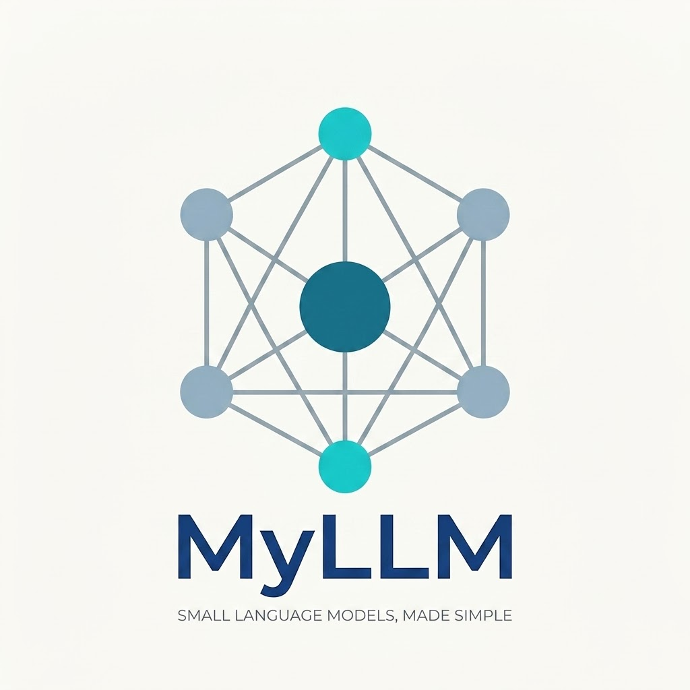

# MyLLM — A Transparent Framework for Small Language Models

<p align="center">
  
</p>

<p align="center">
  <strong>Build it. Understand it. Train it. Run it.</strong>
</p>

<p align="center">
  A transparent PyTorch framework for learning, training, fine-tuning, and running small language models end-to-end.
</p>

<p align="center">


</p>

---

## What is MyLLM?

**MyLLM** is a from-scratch, PyTorch-based framework for building, training, fine-tuning, and running **small language models (SLMs)**.

The goal is simple:

> **Make the entire language-model stack understandable, inspectable, and hackable.**

Instead of hiding the important pieces behind layers of abstractions, MyLLM keeps the core implementation explicit — from tokenization and attention to training, sampling, KV caching, and inference.

The project covers:

```text
Tokenization
     ↓
Transformer Architecture
     ↓
Pretraining
     ↓
Supervised Fine-Tuning
     ↓
Preference Optimization / RLHF
     ↓
Inference
     ↓
KV Cache / Quantization
     ↓
Local Deployment
```

MyLLM is designed around a **learning → experimentation → framework** workflow:

```text
notebooks/
    ↓
learn the concept
    ↓
Modules/
    ↓
experiment with the implementation
    ↓
myllm/
    ↓
turn the implementation into reusable framework code
```

### Why small models?

Small models make the entire stack accessible.

You can inspect the architecture, fine-tune the model, experiment with inference optimizations, and deploy locally without requiring a large cluster.

MyLLM therefore focuses primarily on models that an individual developer or researcher can realistically work with on a single consumer GPU.

### What does "from scratch" mean?

"From scratch" refers to the **framework implementation**, not necessarily training every supported model from randomly initialized weights.

MyLLM implements the important components directly in PyTorch:

* Transformer architectures
* Attention mechanisms
* RoPE and RMSNorm
* Tokenizer interfaces
* Training loops
* Fine-tuning
* Sampling
* KV caching
* Checkpointing
* Model loading
* Weight mapping
* Multi-GPU training infrastructure

At the same time, MyLLM can load compatible pretrained weights so you can move from **understanding the implementation → experimenting → actually running models**.

---

## Why MyLLM?

MyLLM is not intended to replace mature production ecosystems such as Hugging Face Transformers.

It serves a different purpose: **transparency and systems-level understanding**.

| Typical high-level framework | MyLLM                                  |
| ---------------------------- | -------------------------------------- |
| Heavy abstraction            | Explicit implementations               |
| Generic model hierarchies    | Readable model code                    |
| Many layers of indirection   | Direct PyTorch modules                 |
| Often inference-oriented     | Training → fine-tuning → inference     |
| Large-scale first            | Single-GPU first                       |
| Harder to trace internals    | Designed for inspection                |
| Framework as the endpoint    | Learning → experimentation → framework |

For example, the core attention implementation is intentionally kept readable rather than hidden behind a deep inheritance hierarchy.

The objective is not fewer lines of code.

The objective is **fewer conceptual layers between you and the model**.

---

## Project Status

MyLLM is an active research and engineering project.

| Component              | Status          |
| ---------------------- | --------------- |
| Core model API         | 🟢 Stable       |
| Model configuration    | 🟢 Stable       |
| GPT-2 loading          | 🟢 Stable       |
| LLaMA-3 loading        | 🟢 Stable       |
| Text generation        | 🟢 Stable       |
| Sampling               | 🟢 Stable       |
| SFT                    | 🟢 Stable       |
| Checkpointing          | 🟢 Stable       |
| DDP / DeepSpeed / FSDP | 🟡 Experimental |
| DPO                    | 🟡 Experimental |
| PPO / RLHF             | 🟡 Experimental |
| Quantization           | 🟡 Experimental |
| Streaming generation   | 🔴 Planned      |

The project intentionally separates **stable framework functionality** from experimental research code.

---

# Quickstart

## Install

```bash
pip install git+https://github.com/silvaxxx1/MyLLM.git
```

## Generate text

```python
from myllm import LLM, GenerationConfig

llm = LLM.from_pretrained("gpt2-small")

result = llm.generate_text(
    "The future of AI is",
    generation_config=GenerationConfig(
        max_length=60,
        temperature=0.8,
        top_k=50,
    ),
    skip_prompt=True,
)

print(result["text"])
```

Example:

```text
The future of AI is not just about bigger models, but about systems that can
reason, plan, and adapt to new situations without extensive retraining...
```

The API handles:

```text
Model configuration
        +
Tokenizer loading
        +
Weight loading
        +
Model initialization
        +
Generation
```

through a single interface.

---

# Architecture

The repository is organized around three layers:

```text
                    MyLLM
                      │
        ┌─────────────┼─────────────┐
        │             │             │
   Tokenization     Models       Training
        │             │             │
   GPT-2 / LLaMA   GPT / LLaMA   Pretraining
   BPE             Attention     SFT
   SentencePiece   RoPE          DPO
                   KV Cache      PPO
        │             │             │
        └─────────────┼─────────────┘
                      │
                      ▼
                  Inference
                      │
              ┌───────┴───────┐
              │               │
          Sampling        Optimization
                              │
                       KV Cache / Quantization
```

At repository level:

```text
MyLLM/
├── notebooks/        # Guided learning path
├── Modules/          # Focused experiments
├── demos/            # Colab-ready examples
├── docs/             # Component-level documentation
├── myllm/            # Core installable framework
└── tests/             # Automated test suite
```

---

# `myllm/` — Core Framework

The core framework is implemented in PyTorch and organized around explicit, composable components.

```text
myllm/
├── model.py
│   └── GPT / LLaMA-style transformer
│
├── api.py
│   └── LLM
│       ├── from_pretrained()
│       ├── generate()
│       ├── generate_text()
│       └── generate_batch()
│
├── Configs/
│   ├── ModelConfig
│   └── GenerationConfig
│
├── Tokenizers/
│   ├── GPT-2 / tiktoken
│   ├── LLaMA2 / SentencePiece
│   ├── LLaMA3
│   └── Trainable tokenizer
│
├── Train/
│   ├── sft_trainer.py
│   ├── dpo_trainer.py
│   ├── ppo_trainer.py
│   └── Engine/
│       ├── training loop
│       ├── callbacks
│       ├── checkpointing
│       └── accelerator/
│           ├── Single GPU
│           ├── DDP
│           ├── DeepSpeed
│           └── FSDP
│
└── utils/
    ├── ModelLoader
    ├── WeightMappers
    ├── Sampler
    └── ModelRegistry
```

---

# Installation

## From GitHub

```bash
pip install git+https://github.com/silvaxxx1/MyLLM.git
```

## Local development

```bash
git clone https://github.com/silvaxxx1/MyLLM.git
cd MyLLM

pip install -e .
```

Or with `uv`:

```bash
uv pip install -e .
```

## Optional dependencies

Training:

```bash
pip install "myllm[train] @ git+https://github.com/silvaxxx1/MyLLM.git"
```

Inference / analysis:

```bash
pip install "myllm[inference] @ git+https://github.com/silvaxxx1/MyLLM.git"
```

Everything:

```bash
pip install "myllm[all] @ git+https://github.com/silvaxxx1/MyLLM.git"
```

---

# Import API

MyLLM exposes both convenient top-level imports and explicit submodules.

### Top-level API

```python
from myllm import (
    LLM,
    ModelConfig,
    GenerationConfig,
    SFTTrainer,
    SFTTrainerConfig,
    get_tokenizer,
)
```

### Submodules

```python
from myllm.train import SFTTrainer, SFTTrainerConfig
from myllm.tokenizers import GPT2Tokenizer, get_tokenizer
from myllm.configs import ModelConfig, GenerationConfig
```

### Attribute access

```python
import myllm

myllm.train.SFTTrainer
myllm.tokenizers.GPT2Tokenizer
```

---

# CLI

```bash
python -m myllm version
```

```bash
python -m myllm models
```

```bash
python -m myllm info gpt2-medium
```

The `info` command can expose model configuration details such as:

* Number of layers
* Attention heads
* Hidden dimension
* Parameter count
* Estimated memory requirements

---

# Fine-Tuning with SFT

MyLLM includes a supervised fine-tuning trainer.

```python
from myllm import ModelConfig
from myllm.train import SFTTrainer, SFTTrainerConfig

trainer = SFTTrainer(
    SFTTrainerConfig(
        output_dir="./output",
        num_epochs=3,
        report_to=[],
    ),
    model_config=ModelConfig.from_name("gpt2-small"),
)

trainer.setup_model()
trainer.setup_data(train_dataloader=my_dataloader)
trainer.setup_optimizer()
trainer.train()
```

The training stack supports:

* Automatic mixed precision
* Gradient accumulation
* Checkpointing
* Experiment tracking
* CPU / GPU execution
* Distributed training infrastructure

DPO and PPO are currently experimental.

---

# Test Suite

MyLLM includes a CPU-only automated test suite designed to validate the framework without requiring pretrained weights.

Tests use a tiny randomly initialized model:

```text
2 layers
64 hidden dimensions
CPU only
No pretrained weights
```

Run the complete suite:

```bash
uv run pytest
```

Current suite:

**128 tests passed — approximately 15 seconds on CPU.**

```text
myllm/tests/
├── conftest.py
├── test_config.py
├── test_model.py
├── test_tokenizers.py
├── test_api.py
├── test_sampler.py
├── test_training.py
└── test_e2e.py
```

| Module     | Tests | Coverage                                          |
| ---------- | ----: | ------------------------------------------------- |
| Config     |    14 | Presets, validation, save/load, memory estimation |
| Model      |    20 | MLP variants, KV cache, RMSNorm, attention, RoPE  |
| Tokenizers |    16 | Factory, encode/decode, special tokens, padding   |
| API        |    19 | Generation APIs and sampling modes                |
| Sampler    |    15 | Repetition penalty, top-k, top-p, EOS             |
| Training   |    36 | Trainers, configs, datasets, checkpoints          |
| E2E        |     8 | Init → train → checkpoint → inference             |

---

# `notebooks/` — Learn by Doing

The notebooks form a progressive path from fundamentals to LLM systems.

```text
0.0  Welcome & orientation

1.1  Data & tokenization
1.2  Byte-pair encoding from scratch

2.1  Attention from scratch
2.2  Multi-head, grouped-query & Flash Attention
2.3  GPT architecture
2.4  LLaMA 3 architecture

3.1  Training loop
3.2  Advanced training
     ├── AMP
     ├── Gradient accumulation
     └── Distributed training

4.1  SFT — text classification
4.2  SFT — instruction following
4.3  PEFT / LoRA

5.1  RLHF with PPO
5.2  DPO

6.1  Inference & text generation
6.2  KV cache
6.3  INT8 quantization
6.4  INT4 / GPTQ quantization

A/B  Appendices
     ├── GPT-2 vs LLaMA2
     └── Gradio UI
```

The notebooks are intended to answer:

> **What is happening inside the framework?**

before asking:

> **How do I use the framework?**

---

# `Modules/` — Focused Experiments

`Modules/` contains isolated experiments where individual concepts can be developed and tested before becoming part of the framework.

```text
Modules/
├── 1.data/
│   └── Dataset loading & preprocessing
│
├── 2.models/
│   ├── GPT
│   ├── LLaMA
│   ├── MHA
│   ├── MQA
│   ├── GQA
│   └── Flash Attention
│
├── 3.training/
│   └── Training loops & utilities
│
├── 4.finetuning/
│   ├── SFT
│   ├── DPO
│   ├── PPO
│   └── QLoRA
│
└── 5.inference/
    ├── KV Cache
    └── Quantization
```

This separation keeps experimental work from unnecessarily complicating the core framework.

---

# `demos/` — Colab Examples

Five Colab-ready notebooks provide a fast path from installation to experimentation.

| Notebook                          | What it covers                                   |
| --------------------------------- | ------------------------------------------------ |
| `00_install_and_setup.ipynb`      | Installation, imports, CLI, memory estimates     |
| `01_quickstart.ipynb`             | Load a pretrained model and generate text        |
| `02_generation_configs.ipynb`     | Sampling strategies and generation configuration |
| `03_tokenizers_and_configs.ipynb` | Tokenizers, configs, save/load                   |
| `04_sft_training.ipynb`           | End-to-end GPT-2 instruction fine-tuning         |

---

# `docs/` — Reference Documentation

The project includes component-level documentation covering the public framework API.

```text
docs/
├── getting-started/
│   ├── installation
│   └── quickstart
│
├── core/
│   ├── ModelConfig
│   ├── GenerationConfig
│   ├── LLM
│   └── GPT model
│
├── tokenizers/
│   ├── overview
│   ├── factory
│   ├── wrapper
│   ├── GPT2
│   ├── LLaMA2
│   ├── LLaMA3
│   └── trainable tokenizer
│
├── training/
│   ├── BaseTrainer
│   ├── SFTTrainer
│   ├── PretrainTrainer
│   ├── DPO
│   └── PPO
│
├── training-configs/
├── engine/
├── utils/
├── cli.md
├── testing.md
└── extension-guide.md
```

Start here:

[`docs/index.md`](docs/index.md)

---

# Supported Models

MyLLM primarily targets models that can be explored, fine-tuned, and run locally.

## Single-GPU-focused lineup

| Model         | Parameters | Authentication     | Approx. FP16 VRAM |
| ------------- | ---------: | ------------------ | ----------------: |
| `gpt2-small`  |       124M | None               |            < 1 GB |
| `gpt2-medium` |       335M | None               |             ~1 GB |
| `gpt2-large`  |       774M | None               |             ~2 GB |
| `gpt2-xl`     |       1.5B | None               |             ~4 GB |
| `llama3-1b`   |      ~1.9B | Hugging Face token |             ~3 GB |

## Larger models

These use the same model-loading and generation interfaces but require substantially more hardware.

| Model        | Parameters | Authentication               | Approx. FP16 VRAM |
| ------------ | ---------: | ---------------------------- | ----------------: |
| `llama3-8b`  |         8B | Hugging Face token           |            ~17 GB |
| `llama2-7b`  |         7B | Hugging Face token + license |            ~16 GB |
| `llama2-13b` |        13B | Hugging Face token + license |            ~32 GB |

> **Note:** VRAM figures are approximate inference-memory estimates and can vary with sequence length, implementation details, KV cache size, and runtime configuration.

Compatible pretrained weights are downloaded and cached locally when using `LLM.from_pretrained()`.

---

# Inference

Inference is a first-class part of MyLLM.

The current stack includes:

* Configurable sampling
* Temperature
* Top-k
* Top-p
* Repetition penalty
* EOS detection
* Batch generation
* KV caching
* Model loading
* Weight mapping
* Memory estimation

Example:

```python
result = llm.generate_text(
    "Explain attention mechanisms:",
    generation_config=GenerationConfig(
        max_length=256,
        temperature=0.7,
        top_k=50,
        top_p=0.95,
    ),
)
```

The goal is to make the inference path understandable enough that optimizations such as **KV caching, quantization, batching, and eventually streaming generation** can be studied directly in the framework.

---

# Training & Scaling

MyLLM is designed to start simple and scale when necessary.

```text
Single GPU
    │
    ├── AMP
    ├── Gradient Accumulation
    └── Checkpointing
         │
         ▼
        DDP
         │
         ▼
     DeepSpeed
         │
         ▼
        FSDP
```

The framework currently includes accelerator support for:

* Single GPU
* Distributed Data Parallel
* DeepSpeed
* Fully Sharded Data Parallel

Large-scale distributed training is secondary to the project's main goal of keeping the core stack understandable.

---

# Roadmap

## Core SLM Pipeline

| Status | Item                            |
| ------ | ------------------------------- |
| ✅      | `LLM.from_pretrained()`         |
| ✅      | GPT-2 loading + generation      |
| ✅      | LLaMA-3-1B loading + generation |
| ✅      | SFT trainer                     |
| ✅      | AMP                             |
| ✅      | Gradient accumulation           |
| ✅      | Checkpointing                   |
| 🔧     | DPO trainer                     |
| 🔧     | PPO / RLHF                      |
| 🔧     | Core quantization               |
| ⬜      | Streaming generation            |
| ⬜      | Phi model support               |
| ⬜      | Gemma model support             |
| ⬜      | Qwen small-model support        |

## Learning & Reference

| Status | Item                                |
| ------ | ----------------------------------- |
| ✅      | 21 guided notebooks                 |
| ✅      | Modular experiments                 |
| ✅      | 5 Colab-ready demos                 |
| ✅      | Component-level documentation       |
| ✅      | 128-test suite                      |
| ✅      | Attention and inference experiments |
| ✅      | Quantization experiments            |

## Distributed Systems

| Status | Item                             |
| ------ | -------------------------------- |
| ✅      | DDP support                      |
| ✅      | DeepSpeed support                |
| ✅      | FSDP support                     |
| ✅      | 7B–13B model loading             |
| ⬜      | Multi-node training guide        |
| ⬜      | Distributed inference benchmarks |
| ⬜      | Performance benchmark suite      |

---

# Setup for Development

Recommended:

```bash
uv sync
```

Or:

```bash
pip install -e .
```

Requirements:

```text
Python 3.10+
PyTorch 2.x
```

Run tests:

```bash
uv run pytest
```

Run the CLI:

```bash
python -m myllm version
```

---

# Development Philosophy

MyLLM follows a few principles.

### 1. Readability over abstraction

The code should be understandable by someone who wants to inspect the implementation.

### 2. Explicit over magical

Important operations should be visible rather than hidden behind unnecessary abstractions.

### 3. Learn first, optimize second

Start with a clear implementation.

Then measure it.

Then optimize it.

### 4. Experiments should graduate into reusable components

Experimental implementations live in `Modules/`.

Stable implementations move into `myllm/`.

### 5. The framework should expose the systems underneath

The goal is not only:

```python
model.generate(...)
```

but understanding what happens underneath:

```text
Tokenizer
   ↓
Embedding
   ↓
Attention
   ↓
MLP
   ↓
Residual Stream
   ↓
KV Cache
   ↓
Logits
   ↓
Sampling
   ↓
Next Token
```

---

# Contributing

Contributions are welcome.

Useful areas include:

* New model architectures
* Tokenizer implementations
* Attention optimizations
* Inference optimizations
* Quantization
* DPO implementation
* PPO / RLHF
* Training infrastructure
* Distributed training
* Documentation
* Notebooks
* Tests

Before submitting a larger change, open an issue to discuss the design.

Before submitting a PR, run:

```bash
uv run pytest
```

and make sure the existing test suite passes.

---

# Citation

If you use MyLLM in research, education, or technical writing, please cite:

```bibtex
@software{myllm2025,
  author = {Silva},
  title  = {MyLLM: A Transparent Framework for Small Language Models},
  year   = {2025},
  url    = {https://github.com/silvaxxx1/MyLLM}
}
```

---

# Inspiration

MyLLM draws inspiration from several excellent resources and implementations:

* **Andrej Karpathy** — minimal, understandable language-model implementations
* **Umar Jamil** — practical transformer explanations and implementation
* **Sebastian Raschka** — deep theoretical and practical treatment of LLMs

The project builds on these ideas while extending them into a broader framework covering training, fine-tuning, inference, and systems experimentation.

---

# License

MyLLM is released under the **MIT License**.

See [`LICENSE`](LICENSE) for details.

Copyright © 2025 Silva
