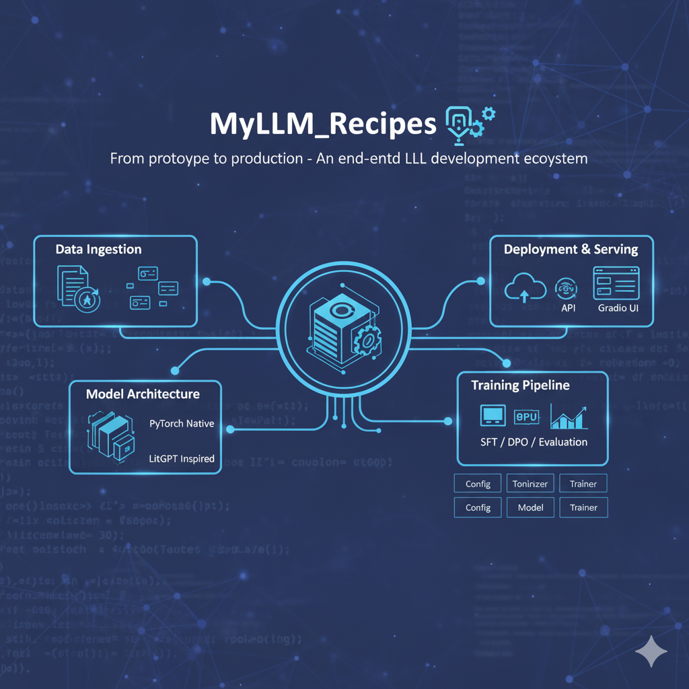

# **MyLLM\_Core** 🧠⚙️

### *A Scalable Framework for Building & Fine-Tuning Production-Grade LLMs*

[](https://opensource.org/licenses/MIT)
[](https://pytorch.org/)
[](https://www.python.org/)
[](https://www.google.com/search?q=)

\<div align="center"\>
\
\<br\>
\<em\>From prototype to production - An end-to-end LLM development ecosystem\</em\>
\</div\>

-----

## **🌟 Why MyLLM?**

| **Feature** | **Advantage** |
| :--- | :--- |
| **Pure PyTorch Native** | Minimal external dependencies with direct PyTorch implementation for full transparency and control. |
| **LitGPT Inspired** | Clean, readable, and efficient code following LitGPT's minimalist design principles. |
| **Transformers-like API** | Familiar API design inspired by Hugging Face Transformers for a gentle learning curve. |
| **Modular Architecture** | Highly modular design for easy extensibility, customization, and integration of new components. |
| **PEFT-Ready** | Seamless integration with Parameter-Efficient Fine-Tuning (PEFT) methods like LoRA and QLoRA. |

-----

## **🏛️ Core Architecture**

MyLLM is built around a powerful, layered architecture. Each component is a self-contained module, allowing you to easily swap out parts or integrate new features.

```
myllm/
├── api.py           # RESTful API for model serving
├── Assets/          # Benchmarking and reporting assets
├── benchmark_api.py # Performance benchmarking suite
├── CLI/             # Command-Line Interface for common tasks
├── Configs/         # Centralized configuration for models, training, and generation
├── Tokenizers/      # Custom tokenizer implementations (GPT-2, Llama, etc.)
├── Train/           # The training engine with SFT, DPO, PPO, and PEFT support
├── models/          # Pre-trained model checkpoints (e.g., .safetensors)
├── tests/           # Unit tests for all core components
└── utils/           # Shared utility functions (e.g., sampler, weight loading)
```

| **Component** | **Description** | **Status** |
| :--- | :--- | :--- |
| **Model** | The core transformer-based LLM with a highly configurable architecture. | ✅ Done |
| **Tokenizers** | A flexible system for managing various tokenization schemes (e.g., GPT-2, Llama). | ✅ Done |
| **Training Engine** | An advanced training pipeline supporting SFT, DPO, and PPO with multi-GPU acceleration. | ✅ Done |
| **PEFT Integration** | Supports LoRA and QLoRA for efficient fine-tuning of large models. | ✅ Done |
| **REST API** | A simple and robust API for model inference and serving. | 🟡 In Progress |
| **CLI & Benchmarking** | A CLI for user interaction and a comprehensive benchmarking suite. | 🟡 In Progress |
| **Model Persistence** | Support for loading and saving pre-trained models and adapters. | 🟡 In Progress |

-----

## **⚙️ Usage Examples**

### **Model Configuration & Creation**

```python
from myllm.Configs import ModelConfig
from myllm.model import LLMModel

# Define your custom model architecture
config = ModelConfig(
    vocab_size=50257,
    hidden_size=768,
    num_layers=12,
    num_attention_heads=12,
    max_position_embeddings=1024
)

# Create the LLM instance
model = LLMModel(config)
```

### **Training with SFT**

```python
import torch
from myllm.Train.sft_trainer import SFTTrainer
from myllm.Train.Engine.trainer_engine import TrainerEngine
from myllm.Train.peft.peft_manager import attach_lora

# Assume my_model and my_dataset are already defined
trainer = SFTTrainer(model=my_model, dataset=my_dataset)

# Attach LoRA adapters for efficient fine-tuning
attach_lora(trainer.model, config=trainer.config)

# Initialize the training engine
engine = TrainerEngine(
    trainer=trainer,
    config={"num_epochs": 3, "optimizer": {"name": "adamw", "lr": 1e-4}}
)

# Run the training loop
engine.train()
```

-----

## **🚀 Getting Started**

### **Installation**

```bash
git clone https://github.com/your-repo/MyLLM.git
cd MyLLM
pip install -e .
```

### **Requirements**

  - Python 3.10+
  - PyTorch 2.0+
  - numpy
  - tqdm
  - safetensors

-----

## **🤝 Contributing**

We welcome contributions\! Some areas where you can help:

  - **Expand Tokenization**: Add support for SentencePiece or other tokenizers.
  - **New Architectures**: Implement new model architectures like Llama or Mistral.
  - **Improve Efficiency**: Enhance training and inference speed with new optimizations.
  - **Documentation**: Write more examples and tutorials.

Just fork the repository, make your changes, and submit a pull request\!

-----

## **📜 License**

MIT License - See [LICENSE](https://www.google.com/search?q=LICENSE%5D\(https://github.com/your-repo/MyLLM/blob/main/LICENSE\)) for details.

-----

## **🙏 Acknowledgments**

This project is inspired by:

  - [LitGPT](https://github.com/Lightning-AI/lit-gpt) for the minimal implementation approach
  - [Hugging Face Transformers](https://github.com/huggingface/transformers) for the API design

-----

\<div align="center"\>
\
\<br\>
\<em\>Let's build the future of open-source LLM tools together\!\</em\>
\</div\>