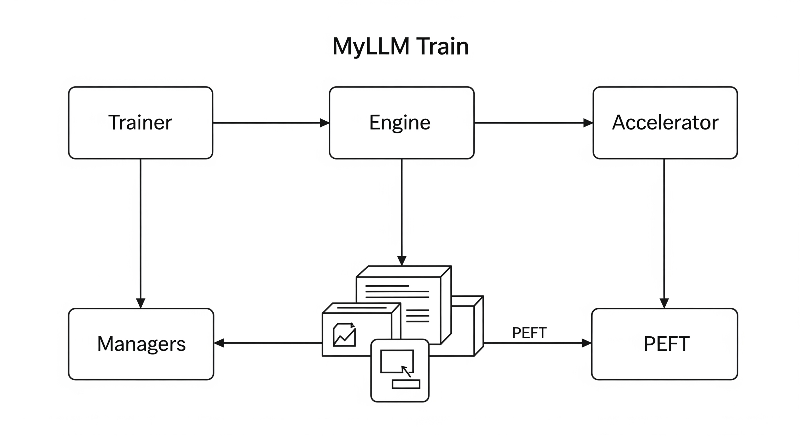

Here is the updated README with an illustration of the workflow.

# 🏋️ MyLLM Train — The Training Engine of MyLLM Core (with PEFT Support)

Welcome to **MyLLM Train**, the **heart of the MyLLM project**, where **models are built, optimized, and fine-tuned**.

This submodule provides a **lightweight yet powerful training backend** for **LLM development**, giving deep control over every step of the training process while staying **minimal, modular, and hackable**.

> **Philosophy:**
> Instead of hiding complexity like other frameworks, MyLLM Train **exposes the internals**, so you can **modify, inspect, and truly understand** what’s happening under the hood.

-----

<p align="center">
  
</p>

## 🔹 What This Engine Does

The `Train` module is the **training backbone** of the MyLLM ecosystem. It supports:

  * ✅ **Core Training Loops** — Supervised Fine-Tuning (SFT), DPO, PPO, and custom algorithms.
  * ✅ **PEFT Training** — LoRA & QLoRA adapters, fully integrated into SFT.
  * ✅ **Accelerator Management** — single GPU, multi-GPU (DDP/FSDP), Hugging Face Accelerate, or DeepSpeed.
  * ✅ **Optimizers & Schedulers** — plug-and-play optimizer configs, LR schedulers, and gradient clipping.
  * ✅ **Checkpointing** — robust saving, resuming, and adapter tracking.
  * ✅ **Callbacks System** — hooks for logging, metrics, and custom behaviors.
  * ✅ **Config-Driven Design** — YAML/JSON configs for fully reproducible experiments.

-----

## 🏗 Folder Structure

```bash
myllm/Train/
├── base_trainer.py # Abstract base class for all trainers
├── trainer.py # Default trainer implementation
├── sft_trainer.py # Supervised Fine-Tuning trainer (supports PEFT)
├── dpo_trainer.py # Direct Preference Optimization trainer
├── ppo_trainer.py # PPO trainer for RLHF
├── train_test.py # Training tests and experiments
│
├── configs/
│   ├── TrainerConfig.py
│   ├── SFTConfig.py # LoRA/QLoRA configs live here
│   ├── PPOConfig.py
│   ├── DPOConfig.py
│   ├── TempConfig.py
│   └── training_config.yaml
│
├── Engine/
│   ├── accelerator/
│   │   ├── base.py
│   │   ├── single_gpu.py
│   │   ├── ddp_accelerate.py
│   │   ├── fspd_accelerate.py
│   │   ├── hf_accerlerate.py
│   │   └── deepspeed_accerlerate.py
│   │
│   ├── optimizer.py # Works with LoRA params
│   ├── lr_scheduler.py
│   ├── checkpoint_manager.py # Handles PEFT adapter checkpoints
│   ├── callbacks.py
│   ├── trainer_engine.py
│   ├── utils.py
│   └── test/
│       ├── test_acceletrate.py
│       └── test_optimizer.py
│
├── peft/ # Dedicated PEFT folder
│   ├── lora.py # LoRA adapter helpers
│   ├── qlora.py # QLoRA-specific helpers
│   ├── adapters.py # Shared adapter utilities
│   └── peft_manager.py # Attach/load/save adapters
│
├── utils/
│   ├── config_manager.py
│   ├── logging_utils.py
│   └── __init__.py
│
└── structure.md
```

-----

## ⚙️ Core Design

At a high level, the engine has **four core layers**:

| Layer | Role | Example Class/Module |
| --- | --- | --- |
| **Trainer** | Implements a training strategy (SFT, PPO, DPO, etc.) | `SFTTrainer`, `PPOTrainer` |
| **Engine** | Orchestrates training loop & integrates all components | `TrainerEngine` |
| **Accelerator** | Abstracts device/backend differences | `SingleGPUAccelerator` |
| **Managers** | Manages optimizers, schedulers, checkpoints, configs | `OptimizerManager` |
| **PEFT** | Applies/adapts LoRA/QLoRA adapters to models | `peft/peft_manager.py` |

> **Trainers** call PEFT adapters via `peft_manager` instead of embedding LoRA/QLoRA logic, keeping the core code clean and modular.

-----

## 🚀 Supported Training Backends

| Backend | File | Use Case |
| --- | --- | --- |
| **Single GPU** | `single_gpu.py` | Simple experiments or debugging |
| **DDP** | `ddp_accelerate.py` | Multi-GPU training with minimal overhead |
| **FSDP** | `fspd_accelerate.py` | Extremely large models with sharded memory |
| **HF Accelerate** | `hf_accerlerate.py` | Quick experiments, integrates with HF ecosystem |
| **DeepSpeed** | `deepspeed_accerlerate.py` | Very large models with ZeRO optimizations |

-----

## 🔧 Example SFT Training Script (with LoRA)

```python
from myllm.Train.Engine.accelerator import SingleGPUAccelerator
from myllm.Train.Engine.trainer_engine import TrainerEngine
from myllm.Train.Engine.optimizer import OptimizerManager
from myllm.Train.Engine.lr_scheduler import SchedulerManager
from myllm.Train.Engine.checkpoint_manager import CheckpointManager
from myllm.Train.Engine.callbacks import PrintCallback
from myllm.Train.sft_trainer import SFTTrainer
from myllm.Train.peft.peft_manager import attach_lora

# Initialize model & dataset
trainer = SFTTrainer(model=my_model, dataset=my_dataset)

# Attach LoRA/QLoRA adapters if specified
attach_lora(trainer.model, config=trainer.config)

# Config
config = {
    "num_epochs": 3,
    "gradient_clip": 1.0,
    "optimizer": {"name": "adamw", "lr": 1e-4}
}

# Accelerators & managers
acc = SingleGPUAccelerator(config)
opt_mgr = OptimizerManager(trainer.model, config)
sched_mgr = SchedulerManager(opt_mgr.optimizer, config)
ckpt_mgr = CheckpointManager(trainer.model) # tracks PEFT adapters too

# Engine
engine = TrainerEngine(
    trainer, acc, opt_mgr, scheduler_manager=sched_mgr,
    checkpoint_manager=ckpt_mgr,
    callbacks=[PrintCallback()],
    config=config
)

engine.setup()
engine.train()
```

-----

## 🔮 Future Plans

| Feature | Status |
| --- | --- |
| Mixed precision training (AMP) | ⚙️ In progress |
| TPU support via XLA | 🛠 Planned |
| Native WandB integration | 🛠 Planned |
| LoRA & QLoRA integration | ✅ Done |
| Dataset streaming support | 🛠 Planned |

-----

## 🧠 Why This Matters

Many frameworks are **too abstracted**, making it difficult to:

  * Debug deep internals
  * Experiment with custom algorithms
  * Scale efficiently without vendor lock-in

MyLLM Train **solves this** by being:

  * **Lightweight** — Pure PyTorch core, minimal dependencies.
  * **Transparent** — Fully accessible and hackable.
  * **Scalable** — Works on laptop → multi-GPU cluster → massive distributed training.
  * **PEFT-ready** — LoRA/QLoRA adapters integrate cleanly into the workflow.

-----

## 📜 License

MIT License — use it, break it, and make it better.

-----

## 🤝 Contribution

Contributions are welcome\!

  * Add a new trainer
  * Build a new accelerator
  * Improve documentation
  * Extend PEFT support

Just fork, hack, and submit a PR.

-----

## 🚀 Final Note

MyLLM Train isn’t just a training engine — it’s a **learning tool** and **research platform**.

> **Goal:** Give you the **tools and visibility** to build, understand, and scale LLM training **without black boxes**.

Go ahead — **train your own MetaBot**. 🦾

-----