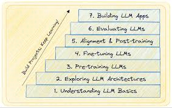

# MyLLM: Notebooks

The `MyLLM/notebooks` directory provides a structured, hierarchical roadmap for building large language models (LLMs) block by block. Each notebook focuses on a specific component, progressing step by step toward a complete pipeline, from data collection to advanced fine-tuning. The structure allows for clarity and modular learning, with dedicated notebooks for building models, training, and evaluation.

## Purpose

This collection of Jupyter notebooks serves as a detailed guide for users interested in understanding and implementing LLMs. The focus is on first principles, building each component separately, and culminating in a complete system that incorporates state-of-the-art NLP techniques.

<p align="center">
    
</p>

### Current Progress

We are currently working on **Notebook 1.2: Tokenizer**, **Notebook 2.2: More Attention**, and **Notebook 3.3: BERT**. These notebooks explore tokenization, advanced attention mechanisms, and bidirectional transformers, and will be completed soon.

### Directory Structure

```
MyLLM/
└── notebooks/
    ├── 1.1_DATA.ipynb                      # Data collection and preprocessing techniques
    ├── 1.2_TOKENIZER.ipynb                 # Tokenizer implementation (in progress)
    ├── 2.1_ATTENTION.ipynb                 # Understanding attention mechanisms in LLMs
    ├── 2.2_MORE_ATTENTION.ipynb            # Advanced attention mechanisms (in progress)
    ├── 3.1_GPT.ipynb                       # Building the GPT architecture
    ├── 3.2_LLAMA.ipynb                     # Building the LLaMA architecture
    ├── 3.3_BERT.ipynb                      # Building BERT and bidirectional transformer models (in progress)
    ├── 4.1_TRAIN.ipynb                     # Training GPT-like models
    ├── 4.2_TRAIN_PRO.ipynb                 # Advanced training techniques and strategies
    ├── 5.1_SFT_Text_Classification.ipynb   # Fine-tuning for text classification tasks
    ├── 5.2_SFT_Instruction_Following.ipynb # Fine-tuning for instruction following tasks
    ├── 5.3_SFT_PEFT.ipynb                  # Fine-tuning with Parameter-Efficient Fine-Tuning (PEFT)
    ├── 6.1_LHG_PPO.ipynb                   # Learning from Human Guidance using PPO
    ├── 6.2_DPO.ipynb                       # Direct Preference Optimization
    ├── Appendix_A_GPT2_to_Llama2.ipynb     # Transitioning models from GPT-2 to Llama 2
    ├── Appendix_B_Generate_with_Gradio_UI.ipynb # Using Gradio to build model inference UIs
    └── README.md                           # This file
```

### Notebook Descriptions

| Name                                  | Description                                                                                   | State            |
|---------------------------------------|-----------------------------------------------------------------------------------------------|------------------|
| **1.1_DATA.ipynb**                    | Covers data collection and preprocessing techniques, including cleaning and organizing data.  | ✅               |
| **1.2_TOKENIZER.ipynb**               | Explores how tokenizers work and demonstrates their implementation.                           | 🔄               |
| **2.1_ATTENTION.ipynb**               | Introduces attention mechanisms with visualizations and examples.                             | ✅               |
| **2.2_MORE_ATTENTION.ipynb**          | Builds on the previous notebook to cover advanced attention strategies.                       | 🔄               |
| **3.1_GPT.ipynb**                     | Guides through building the GPT architecture step by step.                                    | ✅               |
| **3.2_LLAMA.ipynb**                   | Focuses on constructing the LLaMA architecture.                                               | ✅               |
| **3.3_BERT.ipynb**                    | Explores building BERT and its bidirectional approach to understanding text.                  | 🔄               |
| **4.1_TRAIN.ipynb**                   | Covers foundational training methodologies for LLMs, with practical code snippets.            | ✅               |
| **4.2_TRAIN_PRO.ipynb**               | Focuses on advanced training strategies, including hyperparameter optimization.               | ✅               |
| **5.1_SFT_Text_Classification.ipynb** | Explores fine-tuning for text classification tasks, with practical guidance and examples.     | ✅               |
| **5.2_SFT_Instruction_Following.ipynb**| Focuses on adapting models for instruction-following tasks, enhancing interaction capabilities.| ✅               |
| **5.3_SFT_PEFT.ipynb**                | Demonstrates Parameter-Efficient Fine-Tuning (PEFT) for resource-efficient fine-tuning.       | ✅               |
| **6.1_LHG_PPO.ipynb**                 | Explores using Proximal Policy Optimization (PPO) for learning from human guidance.           | ✅               |
| **6.2_DPO.ipynb**                     | Details Direct Preference Optimization for aligning models with user preferences.             | ✅               |
| **Appendix_A_GPT2_to_Llama2.ipynb**   | Guides transitioning models from GPT-2 to Llama 2.                                            | ✅               |
| **Appendix_B_Generate_with_Gradio_UI.ipynb** | Explains how to create a user-friendly interface for model inference using Gradio.        | ✅               |

### Upcoming Additions

Future work will expand on:
- **Exploring LLM Evaulation**
- **Optimization and  Inference**

## Conclusion

This repository provides a comprehensive, modular foundation for building and fine-tuning LLMs. The hierarchical structure ensures that each notebook builds on the previous one, enabling a clear understanding of modern NLP practices while supporting practical applications of state-of-the-art techniques. Stay tuned for future updates!

