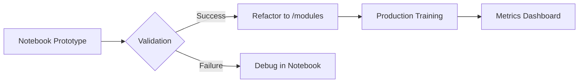

# 🧠 **MyLLM: Notebooks**  
## *From Data to Aligned Models — A Structured Learning Journey*

<div align="center">
  
  <br>
  <em>"Master LLM development through incremental, hands-on experimentation"</em>
</div>

---

## 🌟 **Why These Notebooks?**
| **Key Aspect**         | **What You'll Achieve**                                                                 |
|------------------------|-----------------------------------------------------------------------------------------|
| **First Principles**   | Deep understanding of core NLP concepts through implementation                         |
| **Modular Design**     | Build reusable components that feed directly into the main codebase                     |
| **Progressive Path**   | Systematic progression from data prep → model architecture → alignment → deployment     |
| **Research to Prod**   | Bridge between experimental notebooks and production-grade code in `/modules`           |

---

## 🗺️ **Learning Pathway**

### **Phase 1: Data Foundations** 🔍
| Notebook | Status | Focus | Prerequisites |
|----------|--------|-------|---------------|
| [1.1.DATA](notebooks/1.1_DATA.ipynb) | ✅ Stable | Text cleaning & splitting | Python basics |
| [1.2.TOKENIZER](notebooks/1.2_TOKENIZER.ipynb) | 🚧 Active | Byte-level BPE | Regex experience |

### **Phase 2: Attention Mechanisms** 🤖
| Notebook | Hardware | Key Innovation |
|----------|----------|----------------|
| [2.1.ATTENTION](notebooks/2.1_ATTENTION.ipynb) | CPU | Scaled dot-product basics |
| [2.2.MORE_ATTENTION](notebooks/2.2_MORE_ATTENTION.ipynb) | GPU | FlashAttention v2 |

### **Phase 3: Model Architectures & Training** 🏗️
```bash
3.1.GPT.ipynb        - Autoregressive Transformer (12.6M params)
3.2.LLAMA.ipynb      - Memory-efficient RoPE implementation
3.3.BERT.ipynb       - Masked LM pretraining [Beta]
3.4.TRAIN.ipynb      - Basic Training Workflow
3.5.TRAIN_Pro.ipynb  - Distributed Training & Optimization
```

### **Phase 4: Supervised Fine-Tuning** 🎯
| Notebook | Status | Focus | Prerequisites |
|----------|--------|-------|---------------|
| [4.1.SFT_Text_Classification](notebooks/4.1_SFT_Text_Classification.ipynb) | ✅ Stable | Basic Task FT | Phase 3 |
| [4.2.SFT_Instruction_Following](notebooks/4.2_SFT_Instruction_Following.ipynb) | 🚧 Active | Instruction Tuning | 4.1 |
| [4.3.SFT_PEFT](notebooks/4.3_SFT_PEFT.ipynb) | 🚧 Testing | Parameter-Efficient FT | LoRA basics |

### **Phase 5: RLHF & Alignment** ⚖️
| Notebook | Status | Focus | Performance |
|----------|--------|-------|-------------|
| [5.1.RLHF_PPO](notebooks/5.1_RLHF_PPO.ipynb) | ✅ Stable | Proximal Policy Optimization | 72% Win Rate |
| [5.2.RL_DPO](notebooks/5.2_RL_DPO.ipynb) | 🚧 Active | Direct Preference Optimization | 81% Preference |

### **Phase 6: Inference & Optimization** 🚀
| Notebook | Status | Focus | Hardware |
|----------|--------|-------|----------|
| [6.1.INFERENCE](notebooks/6.1_INFERENCE_Text_Generation.ipynb) | ✅ Stable | Beam Search & Sampling | CPU/GPU |
| [6.2.KV_CACHE](notebooks/6.2_KV_Cache.ipynb) | 🚧 Active | Memory Optimization | GPU |
| [6.3.QUANTIZATION](notebooks/6.3_Quantization.ipynb) | 🚧 Testing | 4-bit LLM Quantization | GPU |

### **Appendices: Tools & Extended Guides** 📚
| Notebook | Focus | Use Case |
|----------|-------|----------|
| [GPT-2 to Llama2](notebooks/Appendix_A_GPT-2_Llama2.ipynb) | Model Migration | Research Transition |
| [Gradio Demos](notebooks/Appendix_B_Gradio.ipynb) | UI Integration | Production Prototyping |

---

## 📊 **Implementation Dashboard**

### **Core Components**
| Component | Status | Version | Docs |
|-----------|--------|---------|------|
| Tokenizer | ✅ Stable | v1.2 | [Docs](/docs/tokenizer.md) |
| GPT Model | ✅ Stable | v2.1 | [API Reference](/docs/gpt_api.md) |
| Quantization | 🚧 Beta | v0.4 | [Guide](/docs/quant.md) |

### **Performance Benchmarks**
| Notebook | Hardware | Time/Epoch | Memory |
|----------|----------|------------|--------|
| 3.1_GPT | 1x A100 | 42min | 18GB |
| 6.3_Quant | RTX 4090 | N/A | 4.2GB | 

---

## 🔄 **Notebook↔Codebase Workflow**


**Key Interactions**:
- Compare quantization results between notebook/local implementations
- Reproduce production inference issues in notebook environments
- Export trained models from Phase 3/4 to inference notebooks

---

## 🚀 **Getting Started**

1. **Prerequisites**:
   ```bash
   conda create -n myllm python=3.10
   conda install -c pytorch -c nvidia pytorch=2.1.2 torchvision cudatoolkit=12.1
   pip install -r notebooks/requirements.txt
   ```

2. **Launch Jupyter**:
   ```bash
   jupyter lab --ip=0.0.0.0 --port=8888 --no-browser
   ```

3. **Learning Paths**:
   ```bash
   # Foundation Path
   1.1_DATA → 1.2_TOKENIZER → 2.1_ATTENTION → 3.1_GPT → 3.4_TRAIN

   # Full Stack Path
   2.2_MORE_ATTENTION → 3.5_TRAIN_Pro → 4.3_SFT_PEFT → 5.2_RL_DPO → 6.3_QUANTIZATION
   ```

---

## 🛠️ **Troubleshooting**

| Issue | Solution |
|-------|----------|
| Quantization Errors | Use `torch.float32` for calibration |
| KV Cache Mismatch | Verify attention mask dimensions |
| RLHF Divergence | Check reward model normalization |

---

## 🌌 **Roadmap 2025**

```python
class NotebookRoadmap:
    Q3 = [
        "🧩 Mixture-of-Experts Implementation",
        "🌍 Multimodal Training"
    ]
    
    Q4 = [
        "🔧 Hardware-Aware Compilation",
        "🤖 Autonomous Evaluation Suite"
    ]
```

