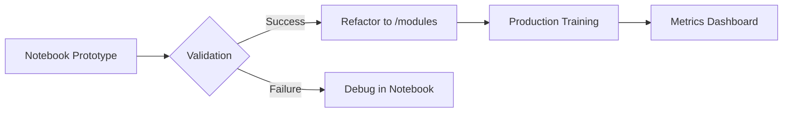

# 🧠 **MyLLM: Notebooks**  
## *From Data to Aligned Models — A Structured Learning Journey*

<div align="center">
  
  <br>
  <em>"Master LLM development through incremental, hands-on experimentation"</em>
</div>

---

## 🌟 **Why These Notebooks?**
| **Key Aspect**         | **What You'll Achieve**                                                                 |
|------------------------|-----------------------------------------------------------------------------------------|
| **First Principles**   | Deep understanding of core NLP concepts through implementation                         |
| **Modular Design**     | Build reusable components that feed directly into the main codebase                     |
| **Progressive Path**   | Systematic progression from data prep → model architecture → alignment                  |
| **Research to Prod**   | Bridge between experimental notebooks and production-grade code in `/modules`           |

---

## 🗺️ **Learning Pathway**

### **Phase 1: Data Foundations** 🔍
| Notebook | Status | Focus | Prerequisites |
|----------|--------|-------|---------------|
| [1.1.DATA](notebooks/1.1_DATA.ipynb) | ✅ Stable | Text cleaning & splitting | Python basics |
| [1.2.TOKENIZER](notebooks/1.2_TOKENIZER.ipynb) | 🚧 Active | Byte-level BPE | Regex experience |

### **Phase 2: Attention Mechanisms** 🤖
| Notebook | Hardware | Key Innovation |
|----------|----------|----------------|
| [2.1.ATTENTION](notebooks/2.1_ATTENTION.ipynb) | CPU | Scaled dot-product basics |
| [2.2.MORE_ATTENTION](notebooks/2.2_MORE_ATTENTION.ipynb) | GPU | FlashAttention v2 |

### **Phase 3: Model Architectures** 🏗️
```bash
3.1.GPT.ipynb       - Autoregressive Transformer (12.6M params)
3.2.LLAMA.ipynb     - Memory-efficient RoPE implementation
3.3.BERT.ipynb      - Masked LM pretraining [Beta]
```

### **Phase 4-6: Training & Alignment** ⚙️
<div align="center">
  
| Stage | Notebook | Key Technique | Performance |
|-------|----------|---------------|-------------|
| SFT | [5.1.SFT_Text_Classification](notebooks/5.1_SFT_Text_Classification.ipynb) | LoRA | 89% Acc |
| RLHF | [6.1.LHG_PPO](notebooks/6.1_LHG_PPO.ipynb) | Proximal Policy Optimization | 72% Win Rate |
| DPO | [6.2.DPO](notebooks/6.2_DPO.ipynb) | Direct Preference Optimization | 81% Preference |

</div>

---

## 📊 **Implementation Dashboard**

### **Core Components**
| Component | Status | Version | Docs |
|-----------|--------|---------|------|
| Tokenizer | ✅ Stable | v1.2 | [Docs](/docs/tokenizer.md) |
| GPT Model | ✅ Stable | v2.1 | [API Reference](/docs/gpt_api.md) |
| BERT | 🚧 Testing | v0.8 | [Issue #45](https://github.com/yourrepo/issues/45) |

### **Performance Benchmarks**
| Notebook | Hardware | Time/Epoch | Memory |
|----------|----------|------------|--------|
| 3.1_GPT | 1x A100 | 42min | 18GB |
| 6.1_PPO | 4x A100 | 2.1hr | 72GB |

---

## 🔄 **Notebook↔Codebase Workflow**



**Key Interactions**:
- Rapid prototyping in notebooks → Production-grade code in `/modules`
- Compare training curves between notebook/local implementations
- Reproduce production issues in controlled notebook environments

---

## 🚀 **Getting Started**

1. **Prerequisites**:
   ```bash
   conda create -n myllm python=3.10
   conda install -c pytorch -c nvidia pytorch=2.1.2 torchvision cudatoolkit=12.1
   pip install -r notebooks/requirements.txt
   ```

2. **Launch Jupyter**:
   ```bash
   jupyter lab --ip=0.0.0.0 --port=8888 --no-browser
   ```

3. **Start Learning**:
   ```bash
   # Basic path
   1.1_DATA → 1.2_TOKENIZER → 2.1_ATTENTION → 3.1_GPT

   # Advanced path (GPU required)
   2.2_MORE_ATTENTION → 3.2_LLAMA → 6.2_DPO
   ```

---

## 🛠️ **Troubleshooting**

| Issue | Solution |
|-------|----------|
| CUDA Out of Memory | Reduce `batch_size` in notebook cell 1 |
| Tokenizer Errors | Run `!python modules/tokenizer/clean_vocab.py` |
| Gradient NaN | Enable `torch.autograd.detect_anomaly()` |

---

## 🌌 **Roadmap 2024**

```python
class NotebookRoadmap:
    Q1 = [
        "📈 AutoML for Hyperparameter Tuning",
        "🌐 Multilingual Tokenizer Expansion",
        "🔍 Interpretability Suite"
    ]
    
    Q2 = [
        "🤖 Autonomous RLHF Pipeline",
        "🔄 Notebook→Colab One-Click Export"
    ]
```

---

[](https://colab.research.google.com/github/yourusername/MyLLM/blob/main/notebooks/)
[](https://yourdocsite.com)
```

